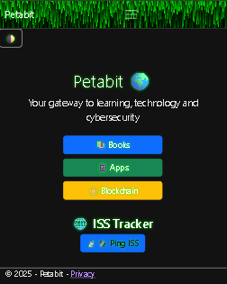

# 🌐 Petabit


**Petabit** je minimalistička, lokalizirana i responzivna ASP.NET Core MVC web aplikacija s integriranim prikazom lokacije, brzine i broja astronauta na Međunarodnoj svemirskoj postaji (ISS). Projekt je razvijen kao demonstracija modernih web tehnologija, dobre prakse i profesionalne prezentacije rada.

---

## ✨ Značajke

- 🌍 **Lokalizacija (i18n)**: podržani jezici su **hrvatski (default)**, **engleski** i **njemački**.
- 🌒 **Dark / Light Mode**: korisnik može birati između tamnog i svijetlog prikaza.
- 📡 **Prikaz ISS-a**:  
  - Prikaz trenutne lokacije ISS-a  
  - Izračun brzine ISS-a u stvarnom vremenu  
  - Broj astronauta i njihova imena  
- 🛜 **Ping ISS gumb** s animacijom i zvučnim efektom
- 📱 Potpuno responzivna stranica za desktop i mobilne uređaje
- 📄 Lokalizirane stranice poput Privacy i Contact

---

## ⚙️ Tehnologije

- ASP.NET Core MVC (.NET 8)
- C#
- Bootstrap 5
- JavaScript (DOM manipulation, fetch API)
- HTML5 & CSS3
- Razor Pages
- JSON API: [open-notify.org](https://open-notify.org/)
- Lokalizacija putem `.resx` datoteka

---

## 🚀 Pokretanje projekta

1. Kloniraj repozitorij:
    ```bash
    git clone https://github.com/chevcelios/petabit.git
    cd petabit
    ```

2. Otvori projekt u Visual Studio 2022

3. Pokreni aplikaciju (`F5`) ili klikom na “Start Debugging”

---

## 📸 Screenshot

### 💻 Desktop prikaz (Dark Mode)

> `/docs/screenshotPetabit.png`  


---

## 📁 Struktura projekta

Petabit/
├── Controllers/
├── Views/
│ ├── Home/
│ ├── Shared/
├── wwwroot/
│ ├── css/
│ ├── js/
├── Resources/
│ ├── Views.Home.Index.hr.resx
│ ├── Views.Home.Privacy.en.resx
│ └── ...
├── Program.cs
├── Startup.cs
└── README.md


---

## 🛡️ Licenca

MIT License — slobodno koristi, modificiraj i dijeli uz atribuciju.

---

## 📬 Kontakt

- GitHub: [Chev Cellios](https://github.com/chevcellios)
- E-mail: [midom.croatia@yahoo.com](mailto:midom.croatia@yahoo.com)

---

## 🌟 Napomena

Petabit je nastao kao portfolio showcase, ali se u budućnosti može proširiti s dodatnim API servisima, bazom podataka, autentifikacijom i CMS funkcionalnošću.

