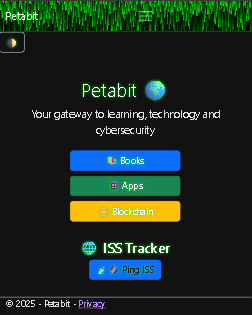

# 🌐 Petabit


Petabit je responzivna i višejezična ASP.NET Core MVC aplikacija za tehnološki sadržaj i praćenje Međunarodne svemirske postaje. Projekt kombinira Razor poglede, lokalizaciju, animirani ISS prikaz, vanjski API i sigurnosne prakse prikladne za javnu web-aplikaciju.

## ✨ Značajke

- hrvatsko, englesko i njemačko sučelje; zadani jezik je engleski
- dark/light tema sa spremanjem korisničkog odabira
- ISS tracker s trenutačnom lokacijom i brzinom postaje
- animirani hologramski prikaz Zemlje, orbite i položaja ISS-a
- LED matrični prikaz lokacije, brzine, posade i spojenih letjelica
- kurirani podaci o posadi i letjelicama s poveznicom na NASA-u
- responzivan navbar, kompaktan footer i prilagođen prikaz na mobilnim uređajima
- stranice za knjige, aplikacije, blockchain i privatnost
- analitika koja se učitava tek nakon korisničke privole

## 🔌 Izvori podataka

- [Where the ISS at? API](https://wheretheiss.at/) — trenutačna lokacija i brzina ISS-a
- [NASA](https://www.nasa.gov/international-space-station/) — referentni podaci o postaji, posadi i letjelicama

Pozicijski podaci dohvaćaju se preko serverskog endpointa `/Home/Data`. Odgovor se kratko sprema u output cache kako bi se smanjio broj poziva vanjskom servisu.

## 🛡️ Sigurnost i privatnost

- HTTPS redirekcija i HSTS u produkciji
- Content Security Policy s jednokratnim nonceom za inline skripte i stilove
- sigurnosna zaglavlja `X-Content-Type-Options`, `X-Frame-Options`, `Referrer-Policy` i `Permissions-Policy`
- antiforgery validacija za POST zahtjeve
- rate limiting ISS endpointa: 60 zahtjeva u minuti
- output cache ISS odgovora u trajanju od 10 sekundi
- sigurno DOM renderiranje API podataka bez umetanja preko `innerHTML`
- culture cookie s `HttpOnly`, `Secure` i `SameSite=Lax` atributima
- Google Analytics 4 učitava se samo nakon izričite privole
- Docker runtime koristi neprivilegiranog korisnika

## ⚙️ Tehnologije

- .NET 10 i ASP.NET Core MVC
- C# i Razor Views
- JavaScript, Canvas API i Fetch API
- HTML5, CSS3 i Bootstrap 5
- `.resx` lokalizacijske datoteke
- ASP.NET Core Output Caching i Rate Limiting
- Docker

## 🚀 Pokretanje lokalno

### Preduvjeti

- [.NET 10 SDK](https://dotnet.microsoft.com/download/dotnet/10.0)
- Visual Studio 2022, Visual Studio Code ili drugi editor po izboru

### Terminal

```powershell
git clone https://github.com/ChevCellios/Petabit.git
cd Petabit
dotnet restore Petabit.sln
dotnet run --project Petabit/Petabit.csproj
```

Aplikacija koristi URL naveden u terminalskom izlazu ili u `Petabit/Properties/launchSettings.json`.

### Visual Studio

1. Otvori `Petabit.sln`.
2. Postavi `Petabit` kao startup projekt.
3. Pokreni aplikaciju tipkom `F5` ili opcijom **Start Debugging**.

## 🐳 Docker

Iz korijena repozitorija:

```powershell
docker build -t petabit -f Petabit/Dockerfile .
docker run --rm -p 3000:3000 petabit
```

Aplikacija je zatim dostupna na `http://localhost:3000`.

## ✅ Provjera projekta

```powershell
dotnet build Petabit.sln -c Release --no-restore -p:UseAppHost=false
```

## 📁 Struktura

```text
PetabitNabrijavanje/
├── Petabit.sln
├── README.md
└── Petabit/
    ├── Controllers/
    │   └── HomeController.cs
    ├── Models/
    ├── Resources/
    ├── Views/
    │   ├── Home/
    │   └── Shared/
    ├── wwwroot/
    │   ├── css/
    │   ├── js/
    │   ├── img/
    │   └── sounds/
    ├── Program.cs
    ├── Dockerfile
    └── Petabit.csproj
```

## 📸 Screenshot



## 📬 Kontakt

- GitHub: [ChevCellios](https://github.com/ChevCellios)
- E-mail: [midom.croatia@yahoo.com](mailto:midom.croatia@yahoo.com)
