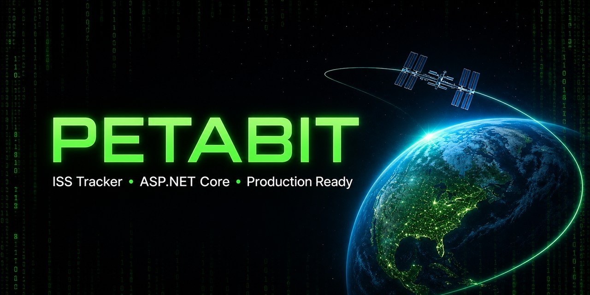
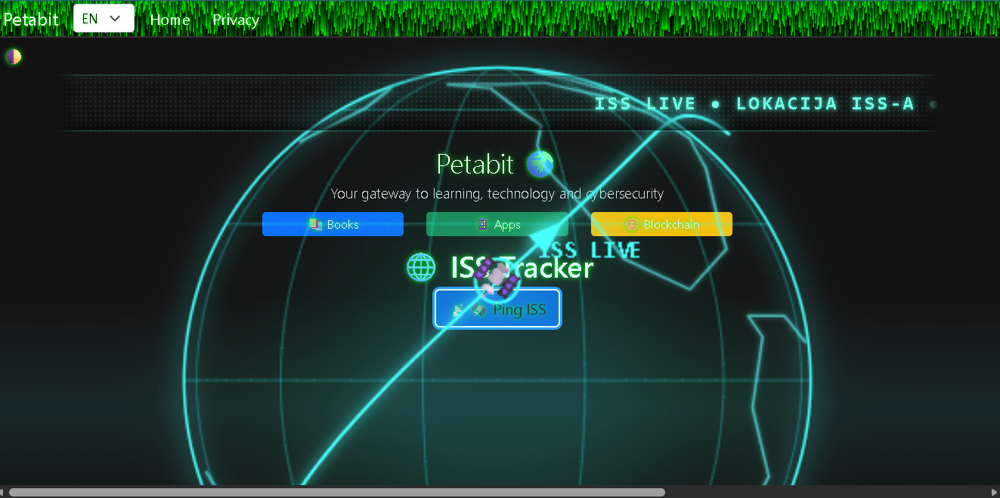

# 🌐 Petabit

[](https://petabit-production.up.railway.app/)

[](https://github.com/ChevCellios/Petabit/actions/workflows/ci.yml)
[](https://github.com/ChevCellios/Petabit/actions/workflows/security.yml)
[](https://github.com/ChevCellios/Petabit/actions/workflows/uptime.yml)


[](LICENSE)

Petabit je responzivna i višejezična ASP.NET Core MVC aplikacija za tehnološki sadržaj i praćenje Međunarodne svemirske postaje. Projekt kombinira Razor poglede, lokalizaciju, animirani ISS prikaz, vanjski API te automatiziran i nadziran produkcijski deployment.

## 🔗 Produkcija

- [Petabit web-aplikacija](https://petabit-production.up.railway.app/)
- [Minimalni ISS tracker](https://petabit-production.up.railway.app/Home/ISSTracker)
- [Readiness provjera](https://petabit-production.up.railway.app/health/ready)

## ✨ Značajke

- hrvatsko, englesko i njemačko sučelje; zadani jezik je engleski
- dark/light tema sa spremanjem korisničkog odabira
- ISS tracker s trenutačnom lokacijom i brzinom postaje
- animirani hologramski prikaz Zemlje, orbite i položaja ISS-a
- LED matrični prikaz lokacije, brzine, posade i spojenih letjelica
- minimalni ISS prikaz kao odvojeno, lagano sučelje nad istim API endpointom
- kurirani podaci o posadi i letjelicama s poveznicom na NASA-u
- responzivan navbar i prikaz prilagođen mobilnim uređajima
- stranice za knjige, aplikacije, blockchain i privatnost
- Google Analytics koji se učitava tek nakon korisničke privole

## 🛰️ Tok ISS podataka

1. Preglednik poziva serverski endpoint `/Home/Data`.
2. ASP.NET Core koristi imenovani `HttpClient` za dohvat podataka s vanjskog ISS API-ja.
3. Resilience pipeline primjenjuje timeout, retry i circuit breaker.
4. Uspješan odgovor sprema se u output cache na 10 sekundi.
5. Klijent sigurno prikazuje lokaciju, brzinu, posadu i spojene letjelice.

Izvori podataka:

- [Where the ISS at? API](https://wheretheiss.at/) — trenutačna lokacija i brzina ISS-a
- [NASA](https://www.nasa.gov/international-space-station/) — referentni podaci o postaji, posadi i letjelicama

## 🛡️ Sigurnost i privatnost

- HTTPS redirekcija i jednogodišnji HSTS u produkciji
- Content Security Policy s jednokratnim nonceom za inline skripte i stilove
- sigurnosna zaglavlja `X-Content-Type-Options`, `X-Frame-Options`, `Referrer-Policy` i `Permissions-Policy`
- antiforgery validacija za POST zahtjeve
- rate limiting ISS endpointa na 60 zahtjeva u minuti
- sigurno DOM renderiranje API podataka bez umetanja preko `innerHTML`
- culture cookie s atributima `HttpOnly`, `Secure` i `SameSite=Lax`
- analitika tek nakon izričite korisničke privole
- Docker runtime pod neprivilegiranim korisnikom
- NuGet audit za poznate ranjivosti i CodeQL analiza C# koda
- Dependabot nadogradnje; automatski merge ograničen je na patch verzije koje prođu sve obvezne provjere

## 🧯 Pouzdanost i nadzor

- timeout, retry i circuit breaker za vanjski ISS servis
- `/health/live` i `/health/ready` health endpointi
- post-deployment smoke test nakon svakog pusha u `master`
- uptime provjera produkcije svakih 15 minuta
- smoke test početne stranice, readiness endpointa i ISS trackera
- strukturirani JSON logovi u produkciji
- validirani `X-Correlation-ID` za povezivanje korisničkog zahtjeva s Railway logovima
- sigurna produkcijska error stranica bez izlaganja detalja iznimke

## 🔄 CI/CD

GitHub Actions na svakom pull requestu i pushu u `master` izvršava:

1. restore NuGet paketa
2. Release build
3. integracijske testove
4. Docker build
5. NuGet security audit
6. CodeQL analizu

Grana `master` zaštićena je pull request pravilima i zahtijeva prolazak sljedećih provjera:

- `Restore, build and test`
- `Build Docker image`
- `Audit NuGet dependencies`
- `Analyze C# with CodeQL`

Nakon mergea Railway automatski deploya novu verziju, a produkcijski smoke test potvrđuje dostupnost aplikacije.

## ✅ Testiranje

Projekt sadrži integracijske testove za:

- live i ready health endpoint
- početnu stranicu i sigurnosna zaglavlja
- minimalni ISS tracker
- uspješan odgovor ISS API-ja
- privremenu nedostupnost vanjskog ISS servisa
- correlation ID u produkcijskom odgovoru

Lokalna provjera cijelog rješenja:

```powershell
dotnet restore Petabit.sln --configfile NuGet.Config
dotnet build Petabit.sln --configuration Release --no-restore -p:UseAppHost=false
dotnet test Petabit.sln --configuration Release --no-build
```

## ⚙️ Tehnologije

- .NET 10 i ASP.NET Core MVC
- C# i Razor Views
- JavaScript, Canvas API i Fetch API
- HTML5, CSS3 i Bootstrap 5
- `.resx` lokalizacija
- ASP.NET Core Output Caching i Rate Limiting
- `Microsoft.Extensions.Http.Resilience`
- xUnit integracijski testovi
- Docker, GitHub Actions i Railway

## 🚀 Pokretanje lokalno

### Preduvjeti

- [.NET 10 SDK](https://dotnet.microsoft.com/download/dotnet/10.0)
- Visual Studio, Visual Studio Code ili drugi editor po izboru

### .NET CLI

```powershell
git clone https://github.com/ChevCellios/Petabit.git
cd Petabit
dotnet restore Petabit.sln --configfile NuGet.Config
dotnet run --project Petabit/Petabit.csproj
```

Aplikacija koristi URL prikazan u terminalu ili postavljen u `Petabit/Properties/launchSettings.json`.

### Docker

```powershell
docker build --tag petabit --file Petabit/Dockerfile .
docker run --rm --publish 3000:3000 petabit
```

Lokalni Docker image koristi port `3000` kada varijabla `PORT` nije postavljena. Aplikacija je tada dostupna na `http://localhost:3000`.

Railway automatski postavlja varijablu `PORT`; produkcijski servis trenutačno koristi target port `8080`.

## 📁 Struktura projekta

```text
PetabitNabrijavanje/
├── .github/
│   ├── dependabot.yml
│   └── workflows/
│       ├── ci.yml
│       ├── dependabot-automerge.yml
│       ├── security.yml
│       └── uptime.yml
├── Petabit.Tests/
│   └── ApplicationTests.cs
├── Petabit/
│   ├── Controllers/
│   ├── Models/
│   ├── Resources/
│   ├── Views/
│   ├── wwwroot/
│   ├── Dockerfile
│   ├── Program.cs
│   └── RequestObservabilityMiddleware.cs
├── NuGet.Config
├── Petabit.sln
└── README.md
```

## 📸 Screenshot



## 🗺️ Moguća buduća poboljšanja

Trenutačna funkcionalnost smatra se stabilnom. Buduća poboljšanja mogu se razvijati odvojeno, bez promjene postojećeg ponašanja:

- automatizirani browser/E2E testovi za navigaciju, temu, jezik i ISS interakcije
- detaljan accessibility pregled tipkovnice, kontrasta i screen reader oznaka
- dodatni testovi za rate limiting, timeout i circuit breaker scenarije
- vanjski alerting za produkcijske iznimke
- izvještaj o pokrivenosti testovima i periodično mjerenje performansi

## 📄 Licenca

Projekt je objavljen pod [MIT licencom](LICENSE). Dopušteni su korištenje, izmjene i distribucija uz zadržavanje obavijesti o autorskim pravima i tekstu licence.

## 📬 Kontakt

- GitHub: [ChevCellios](https://github.com/ChevCellios)
- Pitanja i prijedlozi: [GitHub Issues](https://github.com/ChevCellios/Petabit/issues)
